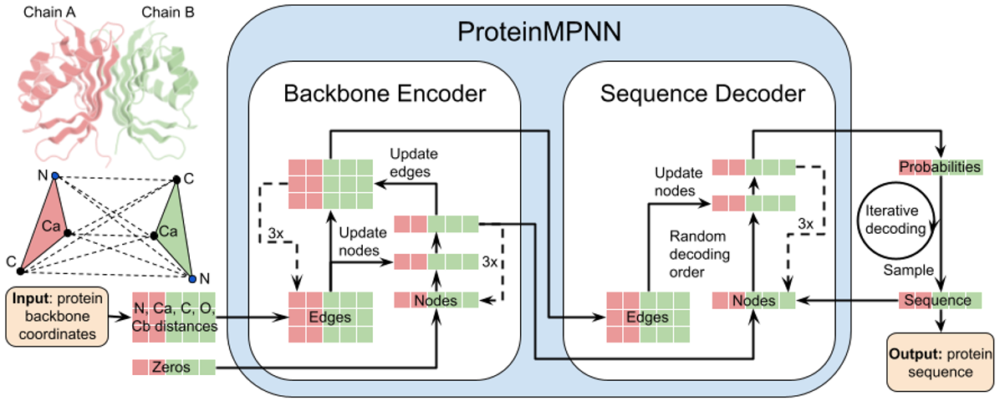
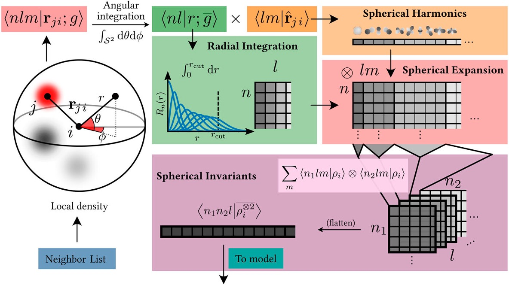

# SO3_Equivariant_ProteinMPNN
## 📌 Master Thesis on Geometric Deep Learning on Protein Design
This is the code for the master thesis that introduce rotation invariant representation to ProteinMPNN

<!-- ABOUT THE RESEARCH -->
<h2 id="about-the-research"> :pencil: About The Research</h2>

**ProteinMPNN** is a message passing neural network that aims to find an amino acid sequence that will fold into a given structure. The full network is composed of an encoder and a decoder with 3 layers each. The network takes as inputs the 3D coordinates and computes the following information for each residue: (i) the distance between the N, Cα, C, O and a virtual Cβ atom, (ii) the Cα − Cα − Cα frame orientation and rotation, (iii) the backbone dihedral angles, (iv) the distances to the 48 closest residues. 
 

Building rotation invariant representation using Sperical Harmonics 

## Dataset
Protein Data Bank

## Prerequisites

  

<!--This project is written in Python programming language.  -->
The following are the major open source packages utilised in this project:
* Numpy
* SciPy
* Matplotlib
* Scikit-Learn
* Pytorch

<h2 id="folder-structure"> Folder Structure</h2>

   
      .  
      ├── notebooks                                                       
      │    ├── Covid19_Search_Engine_BioBERT.ipynb                   
      │    ├── Covid19_NER_BioBERT.ipynb   
      │    └── README.md    
      │    
      │
      └── src
            ├── 0_parse_the_data                        # Part 0 : Parse the Data                                  
            │   ├── parse_the_data.py                   # extract document titles and abstract, output > bio_titles.txt
            │   └── README.md    
            │
            ├──  1_tokenization                          # Part 1 : Tokenization    
            │     ├── tokenization.py                    # tokenized the text by creating top100k token list, output > *_tokens.txt 
            │     ├── tokenizer-bio.json                  
            │     ├── split_tokens.txt
            │     ├── bpe_tokens.txt
            │     ├── nltk_tokens.txt
            │     ├── scispacy_tokens.txt
            │     ├── bert-base-uncased-vocab.txt
            │     └── README.md    
            │
            ├── 2_word_representation                   # Part 2 : Build Word Representations             
            │   ├── n-gram                              
            │   │   ├── n_gram.py                       # create word embedding through n-gram
            │   │   ├── n_gram_word2id.txt             
            │   │   └── README.md 
            │   │
            │   └── skip_gram                           
            │       ├── skip_gram.py                    # create word embedding through skip-gram
            │       ├── new_w2v.model                   # skip-gram model
            │       └── README.md
            │
            ├── 3_visualise_word_representation         # Part 3 : Explore the Word Representations                    
            │   ├── t_sne.py                            # visualised embeddings through t-sne, output > t_sne.png
            │   ├── bio_t_sne.py  
            │   ├── co-occurrence.py                    # find entities that co-occur with Covid 19, output > co-occurrence.csv
            │   ├── co-occurrence.csv                   # co-occurrence output 
            │   ├── semantic_sim.py                     # find entities that semantically similar with Covid 19, output > semantic_sim.txt
            │   ├── semantic_sim.txt
            │   ├── bio_dict                            # dict of biomedical entities for mapping
            │   └── README.md  
            │
            └── README.md  

## 🎯 RoadMap

## Future Work
Benchmarking more physics-inspired representation methods

## Contributing
If you have any questions or suggestions towards this repository, feel free to contact me at xy2119@ic.ac.uk.

Any kind of enhancement or contribution is welcomed!
